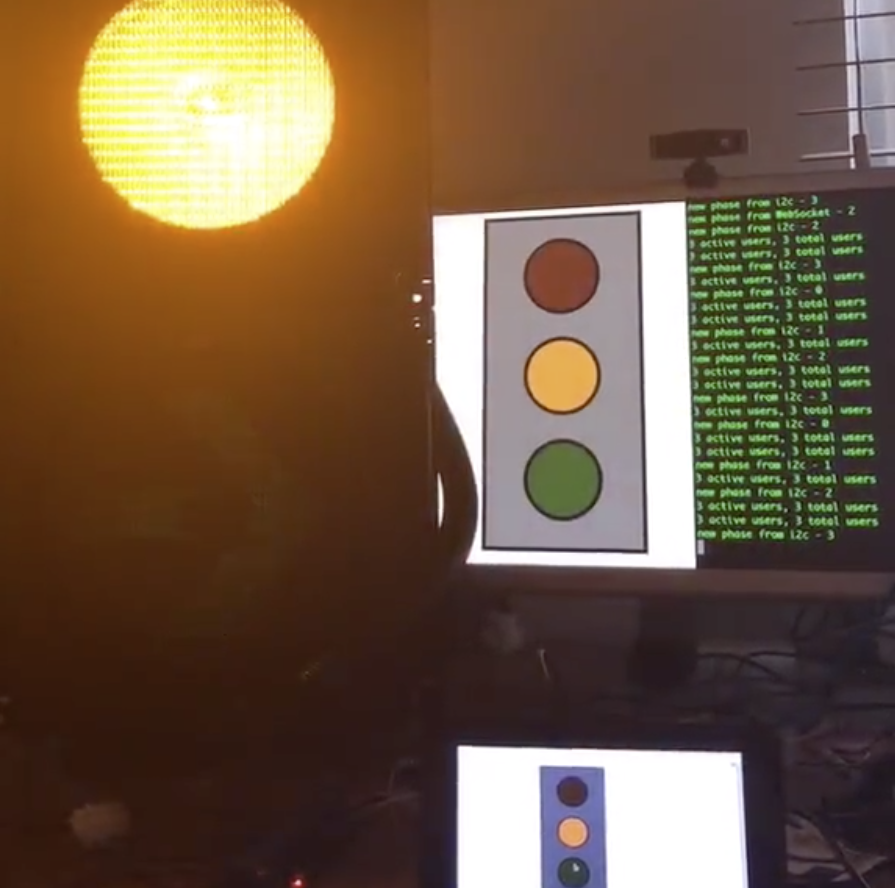

# Internet of Things Traffic Light

This is was an experiment I played with back in 2016, to put a reclaimed 230V traffic light onto the Internet. Allowing a user to connect to a web page, click a colour on the user interface and the command would be sent via a websocket to a Raspberry Pi, which is interfaced over I2C to an Arduino, via a level shifter to account for the Pi's 3V3 and  Arduino's 5V logic levels. The Arduino in turn is connected a set of relays and turns on the appropriate lamp.

This repo contains the source code of the Raspberry Pi nodejs [program](rpi/server.js), the Arduino [sketch](arduino/trafficLight/trafficLight.ino) and a [fritzing](http://fritzing.org/home/) schematic of how to wire it all up.

Below is a photograph of the experiment in action with an additional Raspberry Pi touchscreen display highlighting its multi-user functionality.

